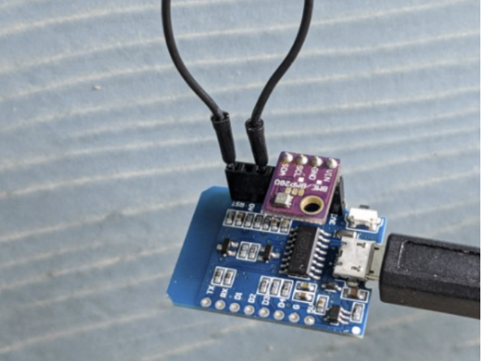

## ESP Weather Station

This tiny ESP8266 Weather Station uses the BME280 chip to measure temperature, humidity and atmospheric pressure or the or BMP280 to measure temperature and atmospheric pressure.
Both 4 pin and 6 pin boards work.  It sends the data to your InfluxDB server where you can use Chronograf or Grafana to visualize weather data over time.

| BME280 4 pin  | BMP280 6 pin |
| ------------- | ------------- |
|  |  |

## ESP flashing

Build the firmware at [nodemcu-build.com](https://nodemcu-build.com/) using these modules: ```adc,bme280,bme280_math,enduser_setup,file,gpio,http,i2c,net,node,rtctime,tmr,uart,wifi```

Use the [ESP8266Flasher.exe](https://github.com/nodemcu/nodemcu-flasher) to flash the ESP.  To enable the ESP's flash mode pull pin D3 to ground and then power-cycle/reset the ESP.

## Copy the lua files onto the ESP

Files in [esp8266-files](esp8266-files) need to be copied to the ESP.  But first rename ```config-example.lua``` to ```config.lua``` and edit the file as needed.
Use [ESPlorer](https://esp8266.ru/esplorer/) to copy ```init.lua``` and ```config.lua``` to the ESP.

## Finish the setup via WIFI access point

After powering on the ESP it'll appear as an WIFI access point.  Connect to this access point using e.g a phone, and finish the setup i.e. connect it to a WIFI network.

## Change the WIFI network

Hold pin D2 low during reset or powerup to claer the WIFI settings.  Then finish the setup via WIFI access point as described above.
